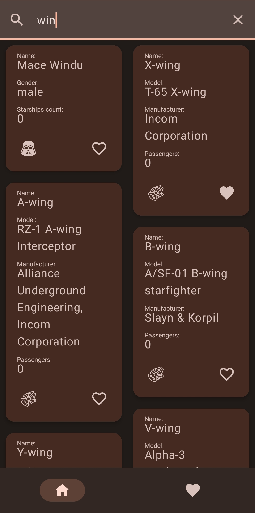
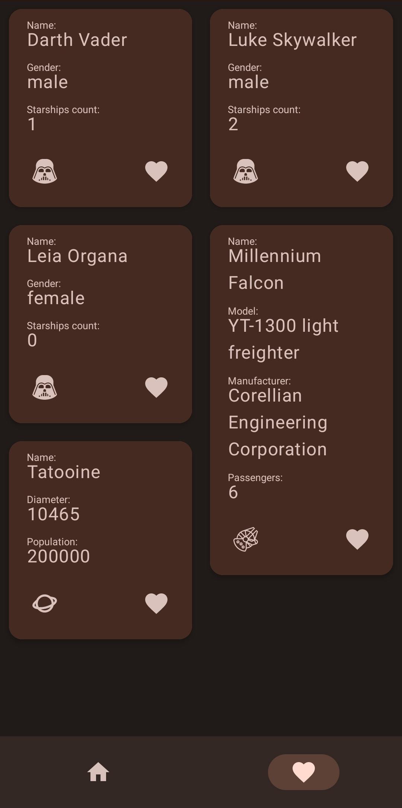

# All About Star Wars App
All About Star Wars App is an application for searching people, starships and planets from the Star Wars movies using the SWAPI and then caching them. This application is built according to the principles of Clean Architecture.

  
  

## Setup
1. [Download Android Studio](https://developer.android.com/studio) for your operating system
2. Select File > New > Project from Version Control...
   
   *Version Control* > `Git`
   
   *URL* > `git@github.com:victorsklyarov/AllAboutStarWarsApp.git`
   
   *Directory* > *select your folder for this project*
   
   Click `Clone`
   
4. Select Run > Run 'app' or push Shift+F10

## Libraries
The application uses the following libraries:

 - **Jetpack Compose:** For UI rendering
 - **Hilt:** For dependency injection
 - **Room:** For local data storage
 - **Retrofit:** For remote data retrieval
 - **Gson:** For JSON parsing
